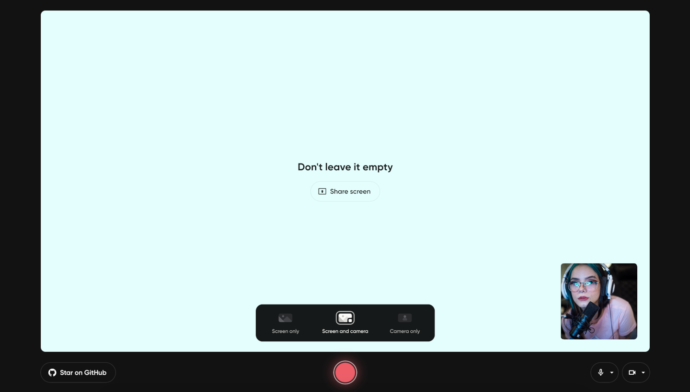
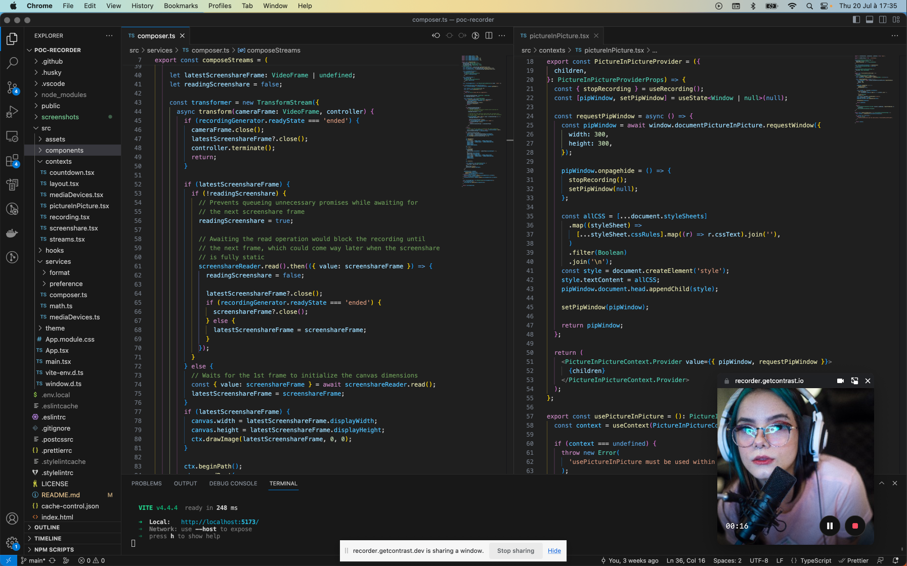

# 🎥 Recorder

Welcome to Recorder, the coolest open-source web application that lets you capture your screen and camera stream right in your browser! No downloads or installations needed – just head over to https://recorder.getcontrast.io, and let the recording begin! 🚀

<a align="center" href="https://recorder.getcontrast.io">
  
  
</a>

## Features

- **Simple and Intuitive:** Recorder offers a user-friendly interface, making recording a breeze for everyone.
- **Screen and Camera Recording:** Capture your browser tab or window while simultaneously adding a personal touch with your camera stream.
- **Picture-in-Picture View:** Experience the magic of picture-in-picture, observing your camera stream overlay while recording your screen.
- **Local and Secure:** Your privacy is a top priority! All recordings take place directly in your browser, keeping your data safe and sound.
- **Real-time Preview:** Preview your camera stream and screen recording in real-time before diving into the action.

## Browser Compatibility

Recorder is designed to rock **Google Chrome**! It leverages certain browser capabilities that may not be available in other browsers at the moment.

## Support

If you encounter any issues, have questions, or need assistance, please feel free to [open an issue](https://github.com/contrastio/recorder/issues) on GitHub. We welcome your feedback and are happy to assist with any questions or concerns you may have.

## Development & Contributions

Excited to dive into the code and make this app even cooler? To get started, follow these steps:

1. **Clone the Repository:** Fork the Recorder repository and clone it to your local machine using Git.

   ```bash
   git clone https://github.com/contrastio/recorder.git
   ```

2. **Navigate to the Directory:** Move into the Recorder project directory.

   ```bash
   cd recorder
   ```

3. **Install Dependencies:** Install the necessary dependencies using Yarn.

   ```bash
   yarn
   ```

4. **Run the Development Server:** Start the development server with Yarn.

   ```bash
   yarn dev
   ```

5. **Make Your Changes:** Work your magic! Make the desired improvements, add features, or fix issues.

6. **Create a Pull Request:** Once you're happy with your changes, create a pull request on the main Recorder repository. We'll review your contribution and merge it if everything looks good!

## License

Recorder is released under the [MIT License](LICENSE), allowing you to freely use, modify, and distribute the application.

<br/>

---

<br/>

Time to unleash your creativity and capture those moments with Recorder! 🎬🌟 Lights, camera, action!
